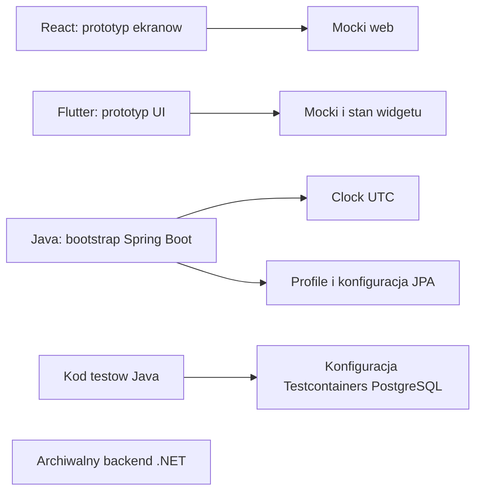
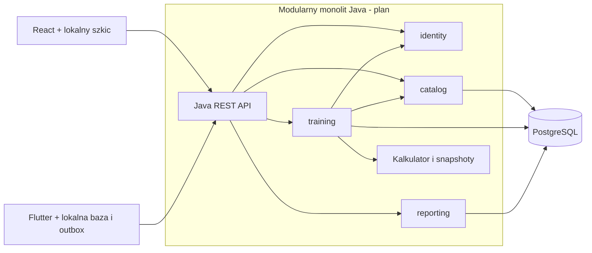

# Komponenty systemu

Data: 2026-10-03. Diagramy ręcznie opracowane z kodu i specyfikacji. Pierwszy opisuje obecność komponentów; drugi jest planem docelowym.

## Stan odczytany z repozytorium

Brak strzałki frontend → Java oznacza brak potwierdzonej integracji treningowej. Konfiguracja testów nie dowodzi ich aktualnego powodzenia.

## Architektura docelowa

Moduły korzystają ze wspólnej bazy, ale zachowują własność danych i publiczne granice. Dokładne porty odczytu między modułami dopracujemy w implementacji. Pełny outbox mobile jest późniejszym przyrostem.

Źródło: [architecture](../architecture.md).
