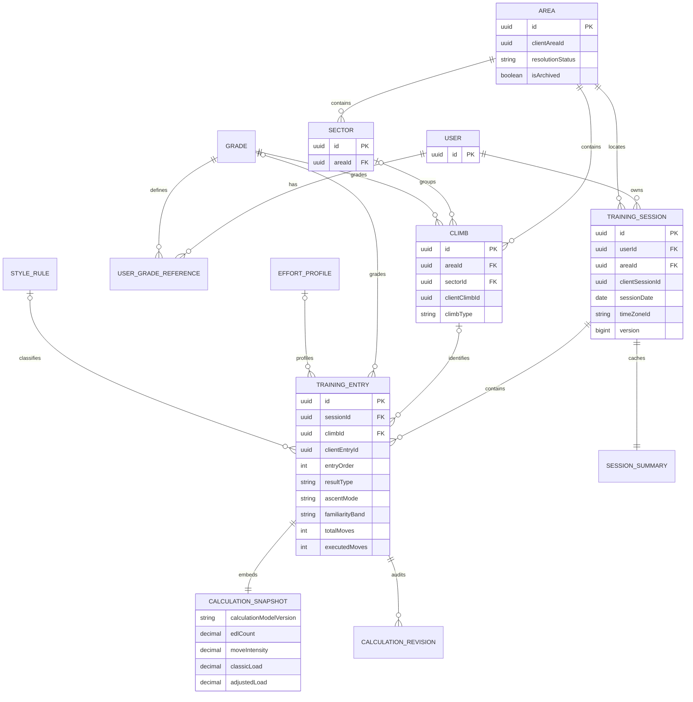

# ERD: planowany model danych

Data: 2026-10-03. Uproszczony model logiczny ze specyfikacji, **nie wygenerowany schemat istniejącej bazy**. Relacja jednego Area na sesję jest zatwierdzona w DEC-018 (zamknięte OPEN-03). Pola nie są kompletnym DDL.

`CalculationSnapshot` i `SessionSummary` są obiektami wartości osadzonymi w kolumnach wpisu i sesji, a nie obowiązkowymi oddzielnymi tabelami. `CalculationRevision` jest wymaganiem dla funkcji zmieniających obliczenia historyczne, jeszcze bez implementacji.

Climb każdego wpisu i jego opcjonalny Sector muszą należeć do Area sesji. Diagram pokazuje relacje; spójność tych powiązań wymaga również walidacji backendu. Jedno Area może mieć wiele sesji, a wiele sektorów w obrębie jednego Area nie wymaga dzielenia treningu.

Opcjonalność Grade/EffortProfile/StyleRule w tym diagramie sygnalizuje nierozstrzygnięty kontrakt WARMUP (OPEN-09); wpis oceniany wymaga odpowiednich danych. Liczność wpisów w ukończonej sesji wymaga doprecyzowania w OPEN-08. Pełne tabele pól oraz planowane constraints są w [database](../database.md).
