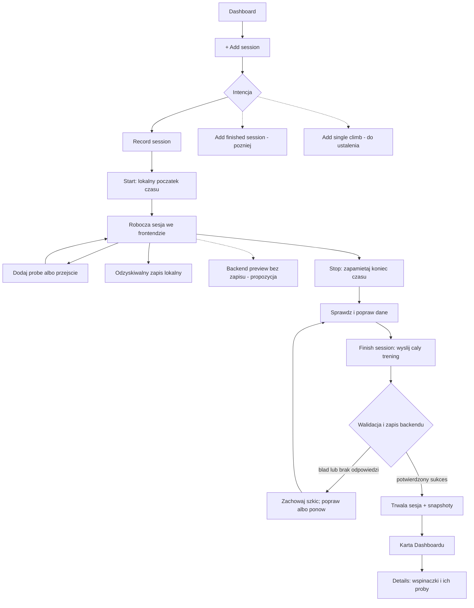

# Flow: Record session

Data: 2026-10-03. Projekt przepływu z ustaleń 2026-09-22 i DEC-021; nie opis działającego UI. Utrwalenie szkicu jest wymagane. Backendowy preview oraz polityka wielu kart i liczby szkiców pozostają w OPEN-04.

Start nie tworzy sesji w backendzie. Brak pauzy. Stop nie zapisuje treningu na serwerze; czas sprawdzania danych po Stop nie wydłuża sesji. Retry zachowuje stabilne ID. Przy utracie odpowiedzi backend może już mieć zapis — ponowienie ma go rozpoznać.

Źródło: [training](../../business/training.md).
